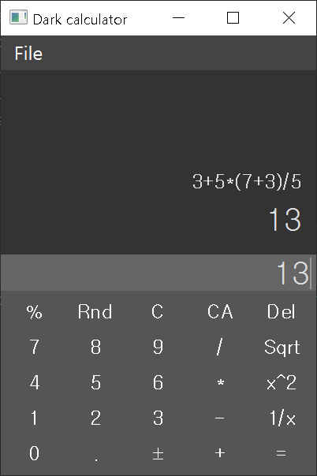

# pyqt-dark-calculator

## Table of Contents
* [General Info](#general-info)
* [Requirements](#requirements)
* [Setup](#setup)
* [Usage](#usage)
* [Preview](#preview)

## General Info
Dark theme calculator made with PyQt5

## Feature
* Basic operation supported by most of the calculators(e.g. Arithmetic operation, square root, round)
* Supporting parentheses calculation
* Being able to open new calculator window
* Show tooltip(helpful message to how the button works) when mouse cursor hovered to button

## Requirements
* PyQt5 >= 5.8

## Included Packages
* <a href="https://github.com/yjg30737/pyqt-resource-helper.git">pyqt-resource-helper</a>

## Setup
```
pip install git+https://github.com/yjg30737/pyqt-dark-calculator.git --upgrade
```

## Usage
```python
import sys
from PyQt5.QtWidgets import QApplication
from pyqt_dark_calculator import Calculator

if __name__ == "__main__":
    app = QApplication(sys.argv)
    calculator = Calculator()
    calculator.show()
    sys.exit(app.exec_())
```

## Preview

